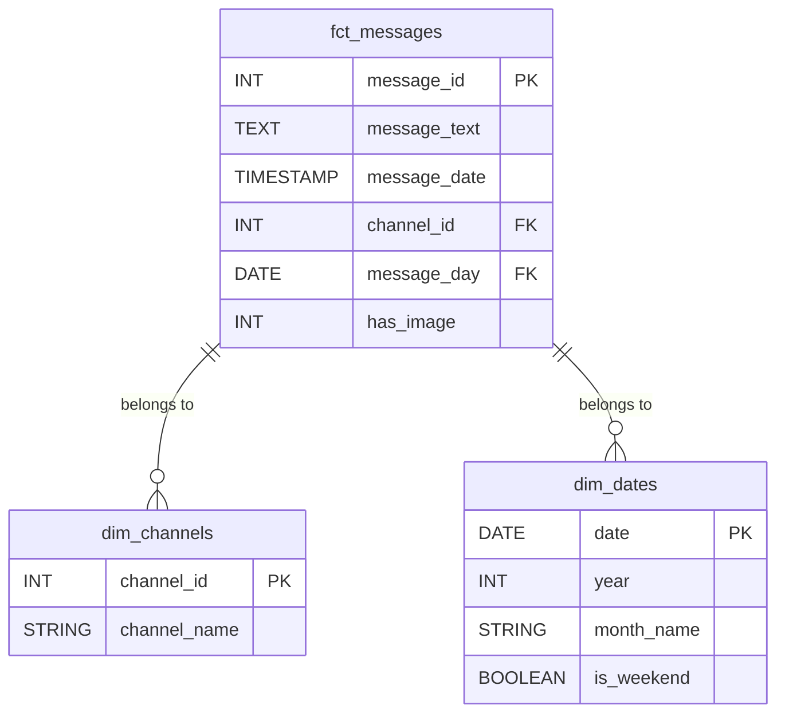

# 📄 End-to-End Data Pipeline for Ethiopian Medical Telegram Channels


---

## 🎯 Project Overview

This repository contains a professional, end-to-end data pipeline that scrapes public Ethiopian medical Telegram channels, transforms and models the data using **dbt**, enriches visual content with **YOLOv8**, exposes insights via a **FastAPI** service, and orchestrates everything using **Dagster**.

### Business Questions Answered:

- What are the top 10 most frequently mentioned medical products?  
- How does product availability vary across channels?  
- Which channels post the most visual content?  
- What are the daily and weekly trends in message volume?

---

## 🧩 Key Features

- ✅ Scraping of public Telegram messages and images  
- ✅ Raw data lake with partitioned storage  
- ✅ PostgreSQL data warehouse  
- ✅ dbt transformation layer forming a star schema  
- ✅ YOLOv8-based image detection  
- ✅ FastAPI RESTful API for analytics  
- ✅ Dagster orchestration and scheduling  
- ✅ Auto-generated docs via `dbt docs`  
- ✅ Secure `.env` environment config  

---

## 🛠 Tech Stack & Tools Used

| Tool           | Purpose                                      |
|----------------|----------------------------------------------|
| Telethon       | Scrape Telegram messages & media             |
| PostgreSQL     | Data warehouse for structured storage        |
| dbt            | Data transformation and testing              |
| YOLOv8         | Image object detection                       |
| FastAPI        | Expose analytics through APIs                |
| Dagster        | Orchestrate full data pipeline               |
| python-dotenv  | Manage secrets securely                      |
| Logging        | Debug and monitor progress/errors            |

---

## 🧱 Methodology

### ⚙️ Layered Architecture (Modern ELT)

Telegram API
→ JSON Data Lake
→ PostgreSQL (raw)
→ dbt (staging + marts)
→ YOLOv8 (image detection)
→ FastAPI (analytics)
→ Dagster (orchestration)

yaml
Copy
Edit

---

### 🗃️ Data Lake Structure

data/raw/telegram_messages/YYYY-MM-DD/channel_name.json
data/raw/images/channel_name/message_id.jpg

yaml
Copy
Edit

---

### 🏗️ dbt Data Transformation

- **dim_channels** – Telegram channel metadata  
- **dim_dates** – Calendar attributes for trend analysis  
- **fct_messages** – Main fact table for messages  

Includes tests: `not_null`, `unique`, and custom SQL assertions.

---

### 🖼 YOLOv8 Enrichment

- Used pre-trained YOLOv8s model  
- Detected object types like pills, creams  
- Stored results in `fct_image_detections` table  

---

### 🌐 FastAPI Endpoints

- `/api/reports/top-products?limit=10`  
- `/api/channels/{channel_name}/activity`  
- `/api/search/messages?query=paracetamol`  

All endpoints use Pydantic for validation and documentation.

---

### ⚙️ Dagster Orchestration

Defined as individual `ops`:
- `scrape_telegram_data`  
- `load_raw_to_postgres`  
- `run_dbt_transformations`  
- `run_yolo_enrichment`

Managed via Dagster UI: http://localhost:3000

---

## 📁 Folder Structure

```
.
├── .gitignore
├── .env.example
├── requirements.txt
├── README.md
├── data/
│   └── raw/
│       ├── telegram_messages/YYYY-MM-DD/channel.json
│       └── images/channel_name/message_id.jpg
├── src/
│   ├── scraping/
│   ├── yolo/
│   ├── dbt_project/
│   │   ├── models/staging/
│   │   └── models/marts/
│   ├── api/
│   └── dagster_pipeline/
```

---

## 🔧 Installation & Setup

### 1. Clone the Repo

```bash
git clone https://github.com/Addisu-Taye/telegram-data-pipeline-dbt-dagster-yolov8.git
cd telegram-data-pipeline-dbt-dagster-yolov8
```

### 2. Configure Environment

```bash
cp .env.example .env
```

Edit `.env` with your credentials:

```env
TELEGRAM_API_ID=your_api_id
TELEGRAM_API_HASH=your_api_hash
DB_NAME=telegram_data
DB_USER=admin
DB_PASSWORD=adminpass
DB_HOST=localhost
DB_PORT=5432
```

### 3. Install Requirements

```bash
pip install -r requirements.txt
```

---

## 🧪 Running the Pipeline

### 1. PostgreSQL Setup

```sql
CREATE USER admin WITH PASSWORD 'adminpass';
CREATE DATABASE telegram_data OWNER admin;
```

### 2. Scrape Telegram Data

```bash
cd src/scraping
python telegram_scraper.py
```

### 3. Download Images

```bash
python image_downloader.py
```

### 4. Load Raw Data to PostgreSQL

```bash
python load_data.py
```

### 5. Run dbt Transformations

```bash
cd src/dbt_project
dbt debug
dbt run
dbt test
dbt docs generate
```

Open: `target/index.html`

### 6. Run YOLOv8 Image Analysis

```bash
cd src/yolo
python image_analyzer.py
```

### 7. Start FastAPI Server

```bash
cd src/api
uvicorn main:app --reload
```

Visit: [http://localhost:8000/docs](http://localhost:8000/docs)

### 8. Launch Dagster UI

```bash
cd src/dagster_pipeline
dagster dev
```

Visit: [http://localhost:3000](http://localhost:3000)

---

## 🖼 Star Schema (Mermaid Format)



---

## 📊 Business Insights Delivered

| Insight                          | Endpoint                                             |
|----------------------------------|------------------------------------------------------|
| Top 10 mentioned products        | `/api/reports/top-products`                         |
| Posting activity by channel      | `/api/channels/{channel}/activity`                  |
| Search by medical keyword        | `/api/search/messages?query=paracetamol`            |
| Visual object detection by msg   | Stored in `fct_image_detections`                    |

---

## 🧠 Challenges Encountered

- ⚠️ Telegram API rate limiting  
- ⚙️ dbt schema normalization for JSON  
- 🐞 YOLOv8 model file corruption  
- 🧪 Local environment and Docker PostgreSQL sync  

---

## 💡 Learning Outcomes

- Built a layered, modular data pipeline  
- Applied dbt testing and documentation  
- Enriched unstructured data with computer vision  
- Delivered insights via robust APIs  
- Orchestrated all components using Dagster  
- Documented and versioned each step  

---

## 📋 License

MIT License

---

## 📬 Contact

  
- **Email**: addtaye@gmail.com 

---

## 🧩 Acknowledgements

Thanks to:

- 10 Academy & KAIM Team  
- Mentors: Mahlet, Rediet, Kerod, Rehmet  
